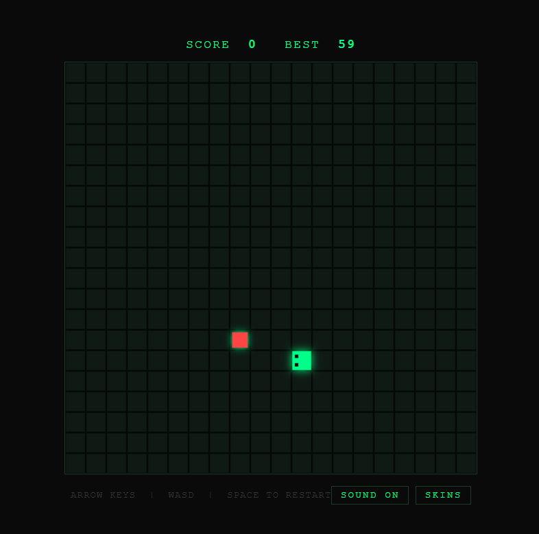
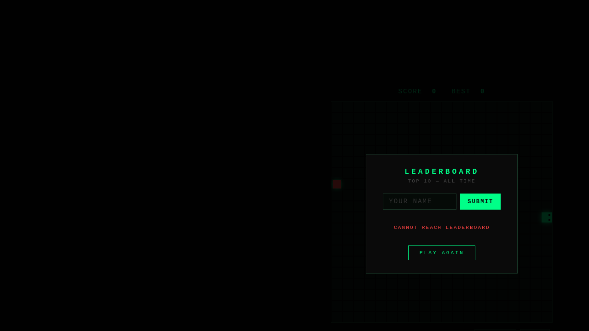
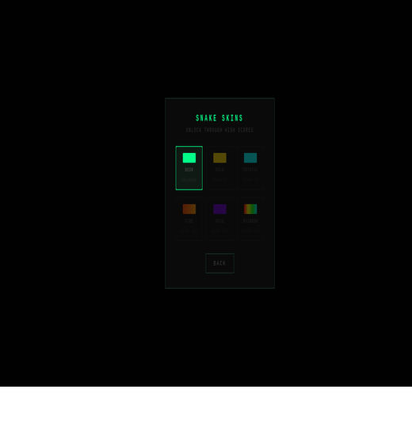

# Snake Game

A single-file Snake game with procedural chiptune music, a skin unlock system, and a persistent leaderboard. No build step — just open `snake.html` in any browser.

**Generated by [Ornith 1.0 35B MoE](https://github.com/mickvel/snake-game)**

---

## Screenshots

### Leaderboard


### Gameplay


### Skin Picker


---

## Features

- **Classic Snake gameplay** — grid-based, wall-collision game over
- **Touch + keyboard controls** — arrow keys, WASD, and swipe on mobile
- **Skin unlock system** — reach score milestones to unlock new snake skins:
  - `NEON` — available from the start (default)
  - `GOLD` — unlock at 25 points (neon gold body)
  - `CRYSTAL` — unlock at 75 points (cyan shimmer)
  - `FIRE` — unlock at 150 points (red-orange gradient)
  - `VOID` — unlock at 300 points (dark purple glow)
  - `RAINBOW` — unlock at 500 points (cycling hue)
- **Procedural chiptune music** — generated with Python + numpy, embedded as base64 WAV
- **Sound effects** — eat, death, skin unlock, button clicks
- **Speed ramp** — game speeds up every 5 points (120ms → 60ms tick interval)
- **Persistent leaderboard** — top 10 scores stored server-side
- **Pause** — press Space or P to pause/resume
- **Dark neon aesthetic** — minimal, retro arcade feel

---

## Quick Start

### Option 1 — Static file only (no leaderboard)

```bash
# Serve locally
python3 -m http.server 8080
# Open http://localhost:8080/snake.html
```

No server-side code needed. The leaderboard section will simply not function (scores won't persist).

### Option 2 — Full setup with leaderboard

```bash
# Terminal 1 — static file server
python3 -m http.server 7070

# Terminal 2 — leaderboard API
python3 leaderboard.py
```

Then open `http://localhost:7070/snake.html`.

---

## Integrating Into Your Website

### Option A — Direct link

Upload `snake.html` to any static host (GitHub Pages, Netlify, Cloudflare Pages, S3, etc.) and link directly to it.

```html
<a href="/snake.html">Play Snake</a>
```

### Option B — Embedded iframe

To embed the game in an existing page:

```html
<iframe
  src="/snake.html"
  width="520"
  height="560"
  style="border: none; display: block; margin: 0 auto;"
  allow="gamepad"
></iframe>
```

> **Note:** The leaderboard API call must be made to the same host that serves the iframe content, or your API server must send `Access-Control-Allow-Origin: *` headers.

### Option C — Hosted separately with custom API

If you host `snake.html` on one domain but the leaderboard API on another, set `window.API_URL` before the script runs:

```html
<script>
  window.API_URL = 'https://your-api.example.com/';
</script>
<script src="/snake.html"></script>
```

Or replace the URL directly in the file (search for `API_URL`):

```javascript
var API_URL = 'https://your-api.example.com/';
```

---

## Leaderboard API

The `leaderboard.py` script is a lightweight FastAPI server. It is not required for the game to run — it only stores scores.

**Endpoints:**

| Method | Path | Description |
|--------|------|-------------|
| `GET` | `/api/scores` | Returns top 10 scores as JSON |
| `POST` | `/api/scores` | Submit a new score: `{"name": "ABC", "score": 42}` |

**Running with a reverse proxy (nginx example):**

```nginx
location /api/ {
    proxy_pass http://127.0.0.1:7071/;
}
```

Leaderboard is disabled when `API_URL` is empty (relative URL) and the leaderboard server is not running.

---

## Regenerating Music

Music is embedded as a base64-encoded WAV in `snake.html`. To tweak or regenerate:

```bash
python3 gen_music.py
# Opens snake.html and replaces the embedded music string
```

Edit the note arrays in `gen_music.py` to change the melody, BPM, or instruments.

---

## Project Structure

```
├── snake.html       # The complete game (single file)
├── gen_music.py     # Music WAV generator (optional)
├── leaderboard.py  # FastAPI leaderboard server (optional)
└── README.md        # This file
```

---

## Browser Compatibility

Tested in modern browsers — Chrome, Firefox, Safari, Edge. Requires Canvas 2D and the Web Audio API. Mobile touch controls supported.
